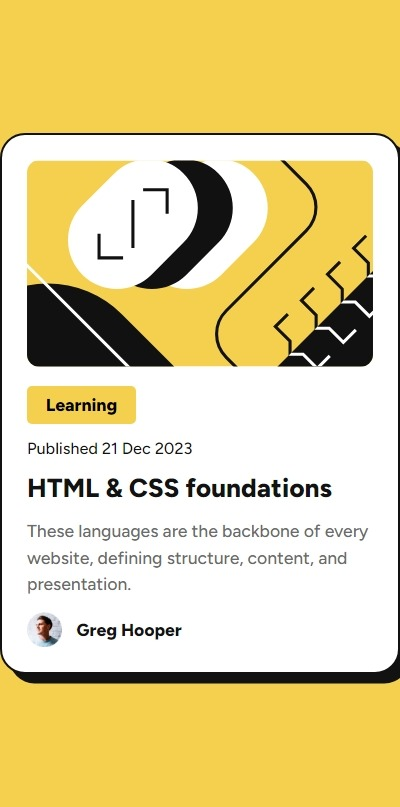
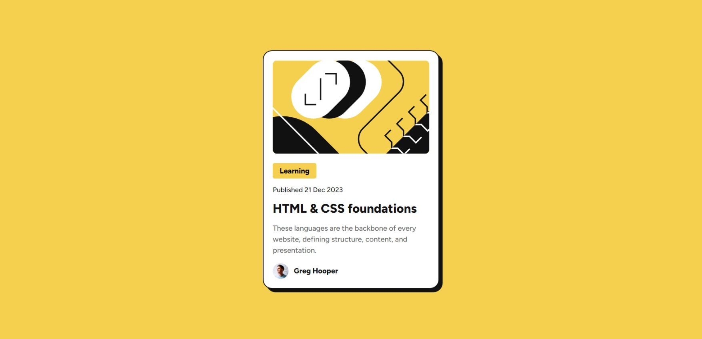

# Frontend Mentor - Blog preview card solution

This is a solution to the [Blog preview card challenge on Frontend Mentor](https://www.frontendmentor.io/challenges/blog-preview-card-ckPaj01IcS). Frontend Mentor challenges help you improve your coding skills by building realistic projects. 

## Table of contents
- [I need help with](#i-need-help-with)
- [Overview](#overview)
  - [The challenge](#the-challenge)
  - [Screenshot](#screenshot)
  - [Links](#links)
- [My process](#my-process)
  - [Built with](#built-with)
  - [Initial Observation](#initial-observation)
  - [Thought Process](#thought-process)
    - [Layout Analysis](#layout-analysis)
    - [Layout Planning](#layout-planning)
  - [Development Approach](#development-approach)
    - [General Reset](#general-reset)
    - [HTML Element](#HTML-element)
    - [Body Styling](#body-styling)
    - [Main Container](#main-container)
    - [SVG and Graphics](#svg-and-graphics)
    - [Text Elements](#text-elements)
    - [Content Description](#content-description)
    - [Profile Picture and Text](#profile-picture-and-text)
    - [Typography](#typography)
  - [What I learned](#what-i-learned)
  - [Continued development](#continued-development)
  - [Useful resources](#useful-resources)
- [Author](#author)
- [Acknowledgments](#acknowledgments)

**Note: Delete this note and update the table of contents based on what sections you keep.**

## Overview

### The challenge

Users should be able to:

- See hover and focus states for all interactive elements on the page

### Screenshot

### Links

- Solution URL: [Github](https://github.com/aditya-alshi/btb/tree/blog-preview-card-main/blog-preview-card-main)
- Live Site URL: [Netlify](https://blog-preview-card-main-fm.netlify.app/)

## My process

### Built with

- HTML
- CSS

### Initial Observation
I started by examining the design images carefully and gathering all relevant information about the layout and elements.

### Thought Process
#### Layout Analysis
- Followed a top-down approach for analysis.
- Identified an SVG graphic and a need for an active text state, likely involving an `<a>` element.
- Noticed a profile image of a person.

#### Layout Planning
- Observed the background using a yellow shade available in the style guide.
- Identified a main container in the layout.
- Decided to divide the main container into sections initially but noticed both mobile and desktop designs share a similar structure, with mobile being a compact version of the desktop layout.
- Therefore, I chose to keep everything in a single section, arranged top-down, one after the other.

### Development Approach
#### General Reset
- Set `padding` and `margin` to `0`.
- Applied `box-sizing: border-box` for consistent element sizing.

#### HTML Element
- Set `font-size: 10px` for easier use of `rem` units (1rem = 10px instead of the default 16px).

#### Body Styling
- Applied `display: flex` on the `<body>` element to center the main blog container using `justify-content: center` and `align-items: center`.
- Set the fonts directly in the body element for consistency.

#### Main Container
- Used the `<main>` element as the main container.
- Applied `display: flex` with a column direction.
- Managed spacing using `margin` and `padding`.

#### SVG and Graphics
- Used semantic `<figure>` and `<figcaption>` elements for the SVG.

#### Text Elements
- Used the `<mark>` element to highlight the "Learning" text for semantic clarity.
- Applied `
` and `<time>` elements for the publication date section: "Published on..."
- Chose an `<h2>` element for the blog post title: "HTML & CSS Foundations."

#### Content Description
- Considered the `
` element for the short information section but found conflicting usage guidance in MDN Web Docs.
- Decided to use a `
` element instead for simplicity and clarity.

#### Profile Picture and Text
- Used a `<figure>` element for the profile image.
- Will explore ways to align the text and image in a single line.

#### Typography
- Used the `clamp()` function for font sizing to ensure responsive and scalable typography.

---
This summarizes my design and development approach for this project. Please share your feedback and suggestions for improvement.

### What I learned

I learned to use the clamp() function in this project.

### Continued development

Since this project specifically avoided media queries, I plan to focus on learning and implementing them in upcoming projects.

### Useful resources

- [MDN Web Docs](https://developer.mozilla.org/)

## Author

- LinkedIn - [Aditya Alshi](https://www.linkedin.com/in/alshi-aditya-fullstack-developer/)
- Frontend Mentor - [@aditya-alshi](https://www.frontendmentor.io/profile/aditya-alshi)
- Twitter - [@AdityaAlshi55](https://x.com/AdityaAlshi55)

## Acknowledgments

- Teodor Jenkler - [@TedJenkler](https://www.frontendmentor.io/profile/TedJenkler) provided valuable feedback and suggestions.

# I need help with
## How was my approach?
- I would appreciate feedback for the approach I took on this project. 
- The font appears unusual at the Mobile-L 425px dimension but looks fine at 320px and resolutions above 425px.
- Created branches for separate projects and left the main branch empty. Is that a good practice?
