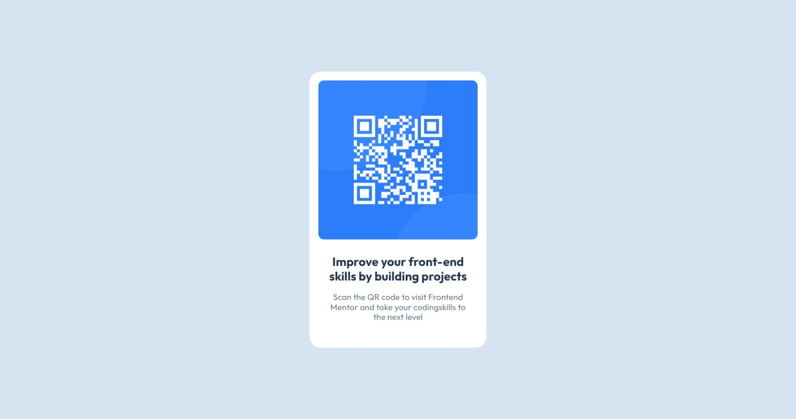

# Frontend Mentor - QR code component solution

This is a solution to the [QR code component challenge on Frontend Mentor](https://www.frontendmentor.io/challenges/qr-code-component-iux_sIO_H). Frontend Mentor challenges help you improve your coding skills by building realistic projects. 

## Table of contents

- [Overview](#overview)
  - [Screenshot](#screenshot)
  - [Links](#links)
- [My process](#my-process)
  - [Built with](#built-with)
  - [What I learned](#what-i-learned)
  - [Continued development](#continued-development)
  - [Useful resources](#useful-resources)
- [Author](#author)
- [Acknowledgments](#acknowledgments)

**Note: Delete this note and update the table of contents based on what sections you keep.**

## Overview

### Screenshot
Mobile view


Desktop view



### Links

- Solution URL: [Github Link](https://github.com/aditya-alshi/btb/tree/main/frontend-related/fm-developement/qr-code-component/qr-code-component-main.github.io)
- Live Site URL: [Netlify hosted project link](https://scintillating-melba-13595a.netlify.app/)

## My process

### Built with

- HTML
- CSS
- Goodle fonts
- Flex box

### What I learned

- First Of all I leant to document my learning for the first time. Thanks to Frontend Mentor for this template.
- I learnt to setup font-size as 10px for the html, so that I can use rem with a clear understanding and reference of 10px in my mind. 
```css
 html {
      font-size: 10px;
    }
```
- Changing the box-sizing to border box helped to make alot sense. I learnt that the default sizing is related to the content box. (Correct me if I'm wrong).
- Started by setting up the basic style. Initailly I messed up but after a while I kind a started catching up with styles
  - Setting up with css variable for colors 
  ```css
  :root {
      --backgroung: hsl(211, 45%, 89%);
      --white: hsl(0, 0%, 100%);
      --text-color-light: hsl(216, 15%, 48%);
      --text-color-mid: hsl(216, 15%, 48%);
      --text-color-dark: hsl(218, 44%, 22%);
    }

  ```
- Tried using aspect ratio for keep the height and width consistent. 

```css
  .attribution {
    aspect-ratio: 0.64/1;
    margin: 0 1rem;
    max-width: 32rem;
    background-color: var(--white);
    padding: 1.6rem 1.6rem 4rem 1.6rem;
    border-radius: 2rem;
  }
  ```

### Chalenges

- Reading through style-guide, I came across something called 'WCAG' and I didn't know what it means. 

- I have tried following WCAG. If there are any suggestion please tell me. 


### Continued development

- I would like to learn more about WCAG
- I will also try using vw for font styling which I tried to apply in this project, but it didn't work. 
- I will also try to take font styling more seriously. Including letter spacing nad line height. 
### Useful resources

- [MDN WEB DOCS](https://developer.mozilla.org/) - For fundamental understanding
- [stackoverflow](https://stackoverflow.com/) - Help about aspect ratio. and 
- [ChatGPT](https://chatgpt.com/)

## Author

- LinkedIn - [Aditya Alshi](https://www.linkedin.com/in/alshi-aditya-fullstack-developer/)
- Frontend Mentor - [@aditya-alshi](https://www.frontendmentor.io/profile/aditya-alshi)
- Github - [aditya-alshi](https://github.com/aditya-alshi)

##
If there are any suggestion please reach out to me.
