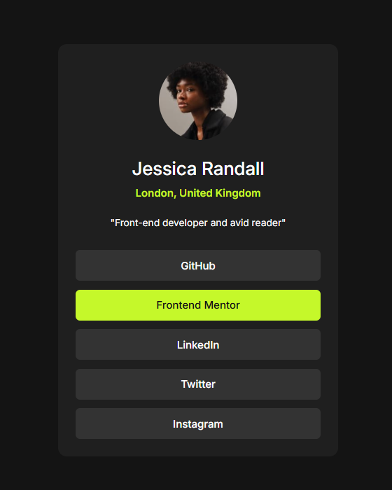
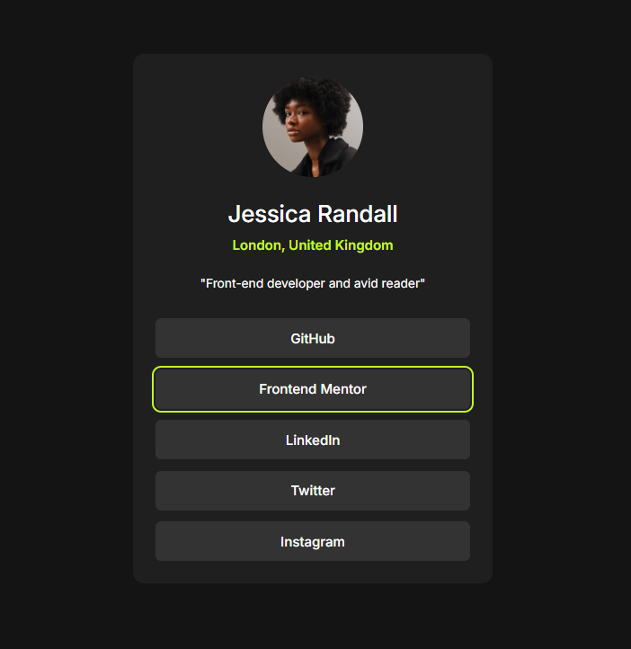
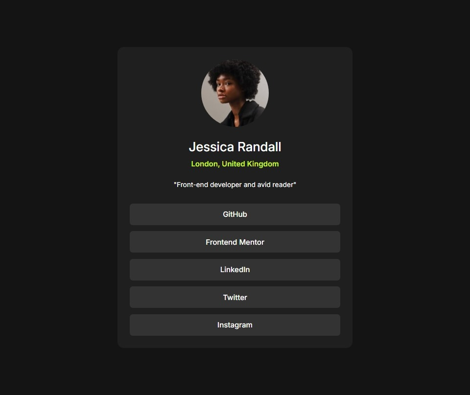
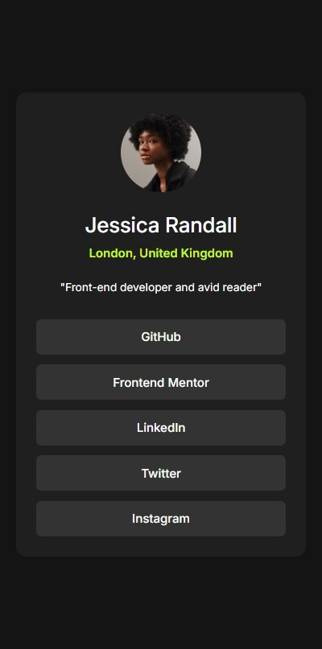
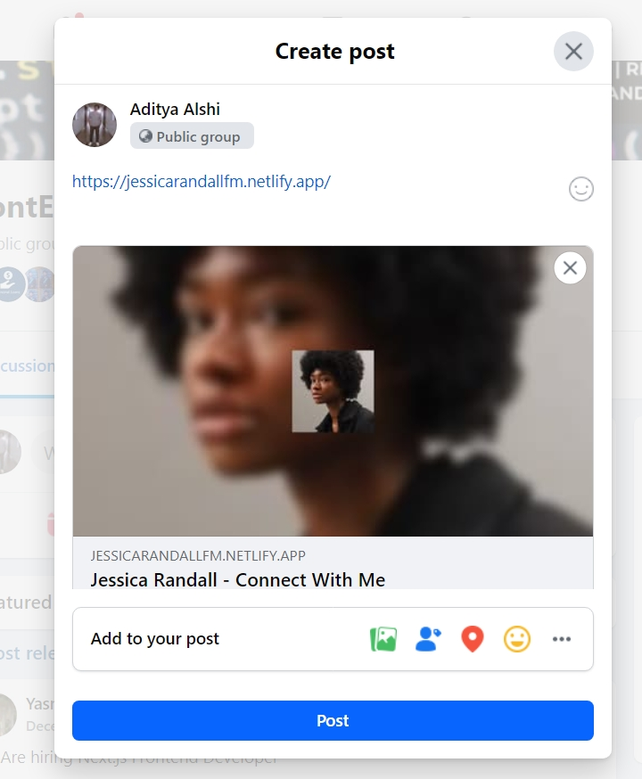

# Frontend Mentor - Social links profile solution

This is a solution to the [Social links profile challenge on Frontend Mentor](https://www.frontendmentor.io/challenges/social-links-profile-UG32l9m6dQ). Frontend Mentor challenges help you improve your coding skills by building realistic projects. 

## Table of contents

- [Overview](#overview)
  - [The challenge](#the-challenge)
  - [Screenshot](#screenshot)
    - [Link active State](#link-active-state)
    - [Link focus State](#link-focus-state)
    - [Laptop view](#laptop-view)
    - [Tablet view](#tab-view)
    - [Mobile Phone view](#mobile-phone-view)
    - [Share-link on Facebook](#share-link-on-facebook)
  - [Links](#links)
- [My process](#my-process)
  - [Built with](#built-with)
  - [What I learned](#what-i-learned)
  - [Continued development](#continued-development)
  - [Useful resources](#useful-resources)
- [Author](#author)

## Overview

### The challenge

Users should be able to:

- See hover and focus states for all interactive elements on the page

### Screenshot

#### Link active State


#### Link focus State


#### Laptop view 


#### Tab view


#### Mobile Phone view


#### Share-link on Facebook


### Links

- Solution URL: [GithHub](https://github.com/aditya-alshi/btb/tree/social-links-profile-main)
- Live Site URL: [Netlify](https://jessicarandallfm.netlify.app/)

## My process

### Built with

- HTML
- CSS

### What I learned

- Improving SEO
- Adding Open Graph using meta
  ```html
    <meta <meta property="og:type" content="website"> 
    <meta property="og:title" content="Jessica Randall - Connect With Me">
    <meta property="og:description" content="Explore Jessica Randall's social media Profile: GitHub, Frontend Mentor, LinkedIn, Twitter, Instagram">
    <meta property="og:image" content="https://jessicarandallfm.netlify.app/assets/images/avatar-jessica_with_bgc.png">
    <meta property="og:url" content="https://jessicarandallfm.netlify.app">
  ```
- Improving accessibility using aria-label
  ```html
    <a href="#" aria-label="Visit Jessica's GitHub Profile">GitHub</a>
  ```
- Adding tabindex-0 for keyboard navigation
  ```html
    
    <h1 tabindex="0">Jessica Randall</h1>
    <h2 tabindex="0">London, United Kingdom</h2>
    <h3 tabindex="0">"Front-end developer and avid reader"</h3>
  ```

- For Focus state added focus-visible to all elements
  ```css
    *:focus-visible {
        outline: 2px solid var(--the-green);
        outline-offset: 2px;
      }
  ```

### Continued development

I'll keep working on imrovement in SEO as well as accessibility. 

### Useful resources

- [Image Resizing](https://www.simpleimageresizer.com/resize-image-for-facebook) - It helped resize the image to facebook's Link Preview minimum requirement

## Author

- Website - [GitHub](https://github.com/aditya-alshi)
- Frontend Mentor - [@aditya-alshi](https://www.frontendmentor.io/profile/aditya-alshi)
- Twitter - [@AdityaAlshi55](https://x.com/AdityaAlshi55)
